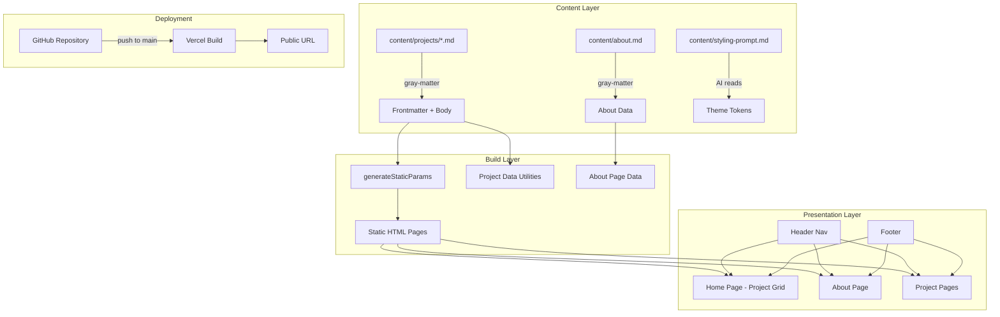
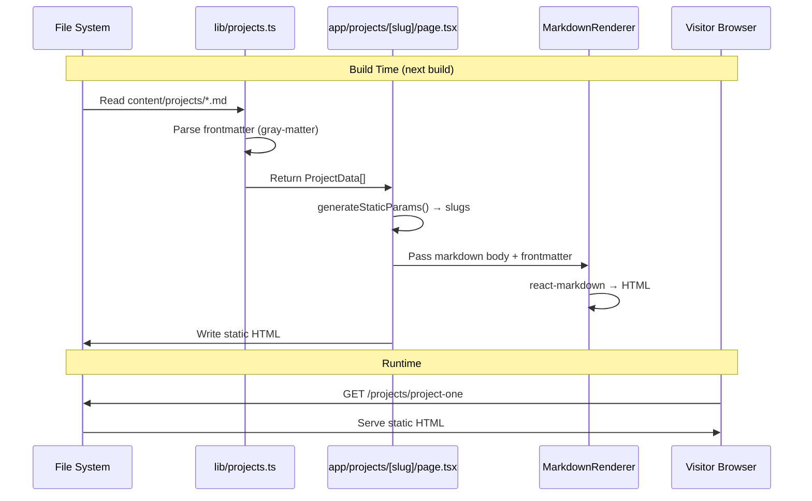

# Design Document: Slalom UX Portfolio

## Overview

This design describes a statically generated portfolio website for Scott Conover, a UX designer at Slalom. The site is built with Next.js (App Router), TypeScript, Tailwind CSS v4, and shadcn/ui. All project content lives in markdown files with YAML frontmatter, and images live in a single folder — both managed by a non-developer through an AI assistant. The site deploys to Vercel via GitHub with zero-config CI/CD.

### Key Design Decisions

1. **Next.js App Router with Static Generation** — All pages are statically generated at build time using `generateStaticParams`. No server runtime or database is needed. This gives fast load times and free Vercel hosting.

2. **Plain Markdown + gray-matter + react-markdown** — Rather than MDX (which requires JSX knowledge), we use plain `.md` files parsed with `gray-matter` for frontmatter and rendered with `react-markdown`. This keeps the authoring experience simple for a non-developer.

3. **Content as data, not code** — Project content lives in a `content/projects/` directory, completely separate from application code. Adding a project means adding a `.md` file and images — no code changes required.

4. **shadcn/ui components** — Used as the base component library. Components are copied into the project (not installed as a package), giving full control over styling and behavior.

5. **Styling Prompt File** — A `content/styling-prompt.md` file holds the "Playful Geometric" design system specification. The AI assistant reads this file and translates it into Tailwind CSS theme tokens and component styles. This file is not consumed by the build — it's a human-to-AI communication channel.

6. **Single image folder with Next.js Image optimization** — All images go in `public/images/`. The Next.js `<Image>` component handles responsive sizing, lazy loading, and modern format conversion automatically.

7. **Playful Geometric Design System** — The visual identity follows the "Playful Geometric" system: warm cream backgrounds (#FFFDF5), hard offset shadows (no blur), chunky 2px borders, vivid multi-color accents (Violet #8B5CF6, Hot Pink #F472B6, Amber #FBBF24, Emerald #34D399), bouncy hover animations, and decorative primitive shapes. Typography uses Outfit for headings and Plus Jakarta Sans for body text. All animations respect `prefers-reduced-motion`.

8. **Lucide React Icons** — Icons use Lucide React with 2.5px stroke width, always enclosed in colored shapes (never floating alone). This matches the Playful Geometric system's tactile, sticker-like aesthetic.

9. **Google Fonts via next/font** — Outfit and Plus Jakarta Sans loaded via `next/font/google` for zero-layout-shift font loading and automatic optimization.

## Architecture

### High-Level Architecture



### Application Structure

```
slalom-ux-portfolio/
├── app/
│   ├── layout.tsx              # Root layout (Header, Footer, fonts)
│   ├── page.tsx                # Home page (project grid + CTA)
│   ├── about/
│   │   └── page.tsx            # About page
│   └── projects/
│       └── [slug]/
│           └── page.tsx        # Dynamic project page
├── components/
│   ├── ui/                     # shadcn/ui components (Button, Card, etc.)
│   ├── header-nav.tsx          # Site-wide navigation (Playful Geometric style)
│   ├── footer.tsx              # Site-wide footer with attribution
│   ├── project-card.tsx        # "Sticker" card with hard shadow + wiggle hover
│   ├── cta-banner.tsx          # "Candy Button" CTA with hard shadow
│   ├── markdown-renderer.tsx   # Renders markdown body to styled HTML
│   ├── project-image.tsx       # Image wrapper with Next.js Image + blob masks
│   ├── decorative-shapes.tsx   # SVG confetti, squiggles, and floating shapes
│   └── section-divider.tsx     # Squiggly SVG section dividers
├── lib/
│   ├── projects.ts             # Read/parse project markdown files
│   ├── about.ts                # Read/parse about page content
│   ├── config.ts               # Site configuration (deck URL, metadata)
│   └── types.ts                # TypeScript interfaces
├── content/
│   ├── projects/               # One .md file per project
│   │   ├── _template.md        # Template with placeholder content
│   │   ├── project-one.md
│   │   └── project-two.md
│   ├── about.md                # About page content
│   └── styling-prompt.md       # Natural-language styling instructions
├── public/
│   └── images/                 # All project images
├── tailwind.css                # Tailwind v4 entry point with theme tokens
├── next.config.ts              # Next.js configuration
├── package.json
├── tsconfig.json
└── README.md                   # Non-developer documentation
```

### Data Flow



## Visual Design System: Playful Geometric

The visual identity is defined by the "Playful Geometric" design system. The core concept is **"Stable Grid, Wild Decoration"** — content lives in clean, readable areas while the surrounding space is alive with decorative shapes, hard shadows, and color.

### Color Tokens (Tailwind CSS v4 Theme)

```css
/* tailwind.css — @theme block */
@theme {
  --color-background: #FFFDF5;       /* Warm Cream (Paper feel) */
  --color-foreground: #1E293B;       /* Slate 800 */
  --color-muted: #F1F5F9;           /* Slate 100 */
  --color-muted-foreground: #64748B; /* Slate 500 */
  --color-accent: #8B5CF6;          /* Vivid Violet (Primary Brand) */
  --color-accent-foreground: #FFFFFF;
  --color-secondary: #F472B6;       /* Hot Pink */
  --color-tertiary: #FBBF24;        /* Amber/Yellow */
  --color-quaternary: #34D399;      /* Emerald/Mint */
  --color-border: #E2E8F0;          /* Slate 200 */
  --color-card: #FFFFFF;
  --color-ring: #8B5CF6;            /* Violet Focus */

  --radius-sm: 8px;
  --radius-md: 16px;
  --radius-lg: 24px;
  --radius-full: 9999px;

  --shadow-pop: 4px 4px 0px 0px #1E293B;
  --shadow-pop-hover: 6px 6px 0px 0px #1E293B;
  --shadow-pop-active: 2px 2px 0px 0px #1E293B;
  --shadow-card: 8px 8px 0px 0px #E2E8F0;
  --shadow-card-featured: 8px 8px 0px 0px #F472B6;

  --font-heading: "Outfit", system-ui, sans-serif;
  --font-body: "Plus Jakarta Sans", system-ui, sans-serif;
}
```

**Color usage rule**: `accent` (Violet) for primary actions. `secondary` (Pink), `tertiary` (Yellow), and `quaternary` (Emerald) used rotationally for decorative shapes, icons, and emphasized words to create a "confetti" effect.

### Typography

- **Headings**: Outfit, Bold (700) or ExtraBold (800). Scale ratio 1.25 (Major Third).
- **Body**: Plus Jakarta Sans, Regular (400) or Medium (500).
- Both loaded via `next/font/google` for zero-layout-shift.

### Component Visual Patterns

**Buttons — "Candy Button" (Primary)**:
- Pill shape (`rounded-full`), 2px solid dark border, hard shadow
- Hover: translate up-left 2px, shadow extends to 6px
- Active: translate down-right 2px, shadow shrinks to 2px
- Bouncy easing: `cubic-bezier(0.34, 1.56, 0.64, 1)`

**Buttons — Secondary**:
- Transparent bg, 2px dark border, pill shape
- Hover: fills with tertiary yellow (#FBBF24)

**Cards — "Sticker" Card**:
- White bg, 2px dark border, `rounded-xl`, soft hard shadow (8px 8px 0px #E2E8F0)
- Hover: rotate -1deg, scale 1.02 (wiggle effect)
- Featured cards get pink shadow (#F472B6)

**Decorative Elements**:
- Floating SVG shapes (circles, triangles, squiggles) behind content sections
- Dot grid background patterns
- Squiggly SVG section dividers
- Confetti shapes absolutely positioned behind content blocks

### Animation & Motion

- **Hover transitions**: `transition-all duration-300 ease-[cubic-bezier(0.34,1.56,0.64,1)]`
- **Entrance animations**: Pop in (scale 0→1 with bounce)
- **Icon wiggle**: `rotate: 0deg → 3deg → -3deg → 0deg` on hover
- **All animations**: Disabled when `prefers-reduced-motion: reduce` is set

### Responsive Adaptations

- **Mobile**: Stack layouts, reduce hard shadows to 2px, hide complex floating shapes, min 48px button height
- **Tablet**: 2-column grids where appropriate
- **Desktop**: Full 3-column project grid, all decorative elements visible

### Iconography

- **Library**: Lucide React
- **Stroke width**: 2.5px (chunky/bold)
- **Style**: Always enclosed in colored circle or shape backgrounds — never floating alone
- **Colors**: White on colored circle, or foreground color on muted circle

## Components and Interfaces

### Page Components

#### RootLayout (`app/layout.tsx`)
The root layout wraps every page with the `HeaderNav`, `Footer`, and global styles. Loads Outfit and Plus Jakarta Sans via `next/font/google`. Sets the warm cream (#FFFDF5) background on the body. Uses semantic HTML structure with `<header>`, `<main>`, and `<footer>` elements.

```typescript
// Props: { children: React.ReactNode }
// Renders: <html> → <body className="bg-background font-body"> → <HeaderNav /> → <main>{children}</main> → <Footer />
```

#### HomePage (`app/page.tsx`)
Reads all project data at build time, renders the CTA banner and a responsive grid of project cards sorted by the `order` frontmatter field. Hero section with Outfit ExtraBold heading, decorative floating shapes (yellow circle, dot grid), and the CTA "Candy Button". Project grid uses 3 columns on desktop, 2 on tablet, 1 on mobile. Each card gets a rotating accent color from the confetti palette.

```typescript
// Server Component — no client-side JS needed for data
// Client wrapper for hover animations
// Calls: getAllProjects() from lib/projects.ts
// Renders: Hero + <CTABanner /> + <DecorativeShapes /> + <ProjectCard /> grid
```

#### AboutPage (`app/about/page.tsx`)
Reads the about page markdown file and renders bio, skills, tools, and methods sections. Bio section with large Outfit heading and Plus Jakarta Sans body. Skills/tools/methods displayed as pill-shaped tags with rotating confetti colors and hard shadows. Decorative shapes in background.

```typescript
// Server Component
// Calls: getAboutContent() from lib/about.ts
// Renders: Bio section + Pill-tag lists for Skills/Tools/Methods + DecorativeShapes
```

#### ProjectPage (`app/projects/[slug]/page.tsx`)
Dynamic route that generates one page per project markdown file. Uses `generateStaticParams` to enumerate all slugs at build time.

```typescript
// Server Component
// Calls: getProjectBySlug(slug) from lib/projects.ts
// Calls: generateStaticParams() → getAllProjectSlugs()
// Renders: Full case study with MarkdownRenderer
```

### Shared Components

#### HeaderNav (`components/header-nav.tsx`)
Persistent navigation bar on every page. Warm cream background with chunky 2px bottom border. Contains links to Home, About, and the external presentation deck (styled as a "Candy Button" with hard shadow). Responsive — collapses to a hamburger menu on mobile with a slide-in panel. Scott's name displayed in Outfit font, bold.

```typescript
interface HeaderNavProps {
  deckUrl: string; // External PowerPoint deck URL
}
```

#### Footer (`components/footer.tsx`)
Footer with attribution text and decorative squiggly SVG divider above it. Uses muted background with foreground text. Displayed on every page via the root layout.

```typescript
// No props — static content
// Renders: Squiggly divider + "Scott Conover — UX Designer at Slalom"
```

#### ProjectCard (`components/project-card.tsx`)
"Sticker" card displayed in the home page grid. White background, 2px dark border, rounded-xl, 8px hard shadow. On hover: rotates -1deg and scales 1.02 with bouncy easing. Thumbnail image with blob-radius mask. Title in Outfit bold, description in Plus Jakarta Sans.

```typescript
interface ProjectCardProps {
  slug: string;
  title: string;
  description: string;
  thumbnail: string; // Image filename in public/images/
  index: number;     // Used to rotate accent colors (violet, pink, yellow, emerald)
}
```

#### CTABanner (`components/cta-banner.tsx`)
Prominent "Candy Button" style CTA at the top of the home page. Accent violet background, white text, pill shape, 2px dark border, hard shadow. Bouncy hover animation. Links to the external PowerPoint deck, opening in a new tab. Decorative floating shapes behind it.

```typescript
interface CTABannerProps {
  url: string;   // External deck URL
  text: string;  // CTA display text
}
```

#### MarkdownRenderer (`components/markdown-renderer.tsx`)
Renders the markdown body of a project into styled HTML using `react-markdown`. Custom component overrides apply Playful Geometric typography (Outfit headings, Plus Jakarta Sans body), styled blockquotes with colored left borders, and image handling that resolves filenames from `/images/` with blob-radius masks.

```typescript
interface MarkdownRendererProps {
  content: string; // Raw markdown body (after frontmatter extraction)
}
```

#### ProjectImage (`components/project-image.tsx`)
Wrapper around Next.js `<Image>` component with Playful Geometric styling: blob-radius mask (asymmetric border-radius), optional hard shadow, and decorative dot-grid pattern behind the image. Resolves image filenames to the `/images/` directory path.

```typescript
interface ProjectImageProps {
  src: string;      // Image filename
  alt: string;      // Descriptive alt text
  priority?: boolean; // Above-the-fold loading hint
  variant?: "blob" | "rounded" | "default"; // Shape variant
}
```

#### DecorativeShapes (`components/decorative-shapes.tsx`)
Renders absolutely-positioned SVG shapes (circles, triangles, squiggles) as background decoration. Uses the confetti color palette (violet, pink, yellow, emerald) rotationally. Hidden on mobile to prevent overlap with content.

```typescript
interface DecorativeShapesProps {
  variant: "hero" | "section" | "footer"; // Determines shape arrangement
}
```

#### SectionDivider (`components/section-divider.tsx`)
Squiggly SVG line used as a section divider between content blocks. Replaces standard horizontal rules with a playful wavy line in a muted color.

```typescript
interface SectionDividerProps {
  color?: string; // Override color (defaults to border color)
}
```

### Data Utilities

#### `lib/projects.ts`

```typescript
// Returns all projects sorted by order field, with frontmatter and body
function getAllProjects(): ProjectData[]

// Returns a single project by slug
function getProjectBySlug(slug: string): ProjectData | undefined

// Returns all slugs for generateStaticParams
function getAllProjectSlugs(): string[]
```

#### `lib/about.ts`

```typescript
// Returns parsed about page content
function getAboutContent(): AboutData
```

## Data Models

### ProjectData (frontmatter + body)

```typescript
interface ProjectData {
  slug: string;           // Derived from filename (e.g., "project-one")
  title: string;          // Project title
  description: string;    // Brief description (shown on card)
  thumbnail: string;      // Thumbnail image filename
  role: string;           // Role and responsibilities
  tools: string[];        // Tools used
  methods: string[];      // UX methods applied
  problem: string;        // Problem statement / challenge
  order: number;          // Sort order for home page grid
  date: string;           // Project date (ISO format)
  images: string[];       // List of image filenames used in the project
  body: string;           // Raw markdown body (process, deliverables, metrics, etc.)
}
```

### AboutData

```typescript
interface AboutData {
  bio: string;            // Professional biography (markdown)
  skills: string[];       // List of UX skills
  tools: string[];        // List of tools
  methods: string[];      // List of UX methods and processes
}
```

### Markdown Template Frontmatter Schema

```yaml
---
title: "Project Title"
description: "Brief one-line description for the project card"
thumbnail: "project-thumbnail.jpg"
role: "Lead UX Designer"
tools:
  - "Figma"
  - "Miro"
methods:
  - "User Research"
  - "Wireframing"
problem: "Description of the problem or challenge"
order: 1
date: "2024-06-15"
images:
  - "project-wireframe.png"
  - "project-final.png"
---

## Process

Markdown content describing the research, wireframes, prototyping, and testing...

## Deliverables

Final outcomes and deliverables...

## Metrics & Impact

Measurable results and impact...
```

### About Page Content Schema

```yaml
---
bio: "Scott Conover is a UX designer at Slalom..."
skills:
  - "User Research"
  - "Interaction Design"
  - "Information Architecture"
tools:
  - "Figma"
  - "Sketch"
  - "Miro"
methods:
  - "Design Thinking"
  - "Usability Testing"
  - "Journey Mapping"
---
```

### Site Configuration

The external deck URL and site metadata are stored as constants in a config file rather than hardcoded across components:

```typescript
// lib/config.ts
export const siteConfig = {
  name: "Scott Conover — UX Portfolio",
  description: "UX design portfolio showcasing work at Slalom",
  deckUrl: "https://...",  // External PowerPoint deck URL
  attribution: "Scott Conover — UX Designer at Slalom",
};
```


## Correctness Properties

*A property is a characteristic or behavior that should hold true across all valid executions of a system — essentially, a formal statement about what the system should do. Properties serve as the bridge between human-readable specifications and machine-verifiable correctness guarantees.*

### Property 1: Project card displays frontmatter fields

*For any* valid `ProjectData` object, rendering a `ProjectCard` component with that data SHALL produce output containing the project's title, description, and a reference to the thumbnail image filename.

**Validates: Requirements 1.2**

### Property 2: Markdown files map one-to-one to project entries

*For any* set of valid markdown files in the content directory, calling `getAllProjects()` SHALL return exactly one `ProjectData` entry per file, with each entry's slug matching the corresponding filename (without extension).

**Validates: Requirements 3.1, 10.1**

### Property 3: Project page renders all available frontmatter sections

*For any* valid `ProjectData` with all frontmatter fields populated, the rendered project page SHALL contain the title, description, role, tools, methods, problem statement, and image references from the frontmatter.

**Validates: Requirements 3.2**

### Property 4: Image references resolve to correct paths with alt text

*For any* image filename referenced in a markdown template, the `MarkdownRenderer` SHALL produce an image element with a `src` attribute resolving to the `/images/` directory path and a non-empty `alt` attribute.

**Validates: Requirements 3.3, 7.4**

### Property 5: Graceful handling of missing frontmatter fields

*For any* markdown file with a random subset of optional frontmatter fields missing, the project parser SHALL return a `ProjectData` object containing the available fields without throwing an error, and the renderer SHALL display the available sections without causing a build failure.

**Validates: Requirements 3.6**

### Property 6: Projects sorted by order field

*For any* set of project markdown files with distinct `order` values in their frontmatter, `getAllProjects()` SHALL return them sorted in ascending order by the `order` field.

**Validates: Requirements 10.3**

## Error Handling

### Content Parsing Errors

| Scenario | Behavior |
|---|---|
| Markdown file with invalid YAML frontmatter | `gray-matter` returns empty data object; project is included with default/empty fields |
| Markdown file with missing required fields (title, description) | Parser fills missing fields with sensible defaults (e.g., slug as title, empty string for description) |
| Markdown file with no frontmatter at all | Entire file content treated as body; frontmatter fields default to empty |
| Image filename in markdown doesn't match any file in `/images/` | Image renders with broken src; Next.js Image component shows alt text. No build failure. |
| Empty content directory (no project files) | Home page renders with no project cards. No build failure. |
| Malformed markdown body | `react-markdown` renders what it can; malformed sections are skipped |

### Build Errors

| Scenario | Behavior |
|---|---|
| `content/projects/` directory missing | Build fails with a clear error message from the file-reading utility |
| `content/about.md` missing | Build fails with a clear error pointing to the missing file |
| TypeScript type mismatch in frontmatter | Handled at parse time with defaults; no build-time type errors |

### Runtime Errors

Since the site is statically generated, runtime errors are minimal. The main concern is broken image links, which degrade gracefully (alt text shown instead of image).

## Testing Strategy

### Unit Tests (Example-Based)

Unit tests verify specific behaviors with concrete examples. Use **Vitest** as the test runner (fast, TypeScript-native, works well with Next.js).

**Content Parsing (`lib/projects.ts`, `lib/about.ts`)**:
- Parse a known markdown file and verify all frontmatter fields are extracted correctly
- Parse a file with missing optional fields and verify defaults are applied
- Parse a file with no frontmatter and verify graceful handling
- Verify `getAllProjectSlugs()` returns correct slugs for known files

**Component Rendering**:
- Render `ProjectCard` with known props and verify title, description, thumbnail, and link
- Render `CTABanner` and verify link URL and `target="_blank"`
- Render `HeaderNav` and verify links to Home, About, and external deck
- Render `Footer` and verify attribution text
- Render `MarkdownRenderer` with known markdown and verify HTML output

**About Page**:
- Render with known content and verify bio, skills, tools, methods sections
- Verify no form elements or download links exist

### Property-Based Tests

Property-based tests use **fast-check** (the standard PBT library for TypeScript/JavaScript) to verify universal properties across randomly generated inputs. Each property test runs a minimum of 100 iterations.

**Configuration**:
- Library: `fast-check`
- Minimum iterations: 100 per property
- Each test tagged with: `Feature: slalom-ux-portfolio, Property {N}: {title}`

**Properties to test**:

1. **Feature: slalom-ux-portfolio, Property 1: Project card displays frontmatter fields**
   - Generate random `ProjectData` objects with `fast-check` arbitraries
   - Render `ProjectCard` with the generated data
   - Assert output contains the title, description, and thumbnail reference

2. **Feature: slalom-ux-portfolio, Property 2: Markdown files map one-to-one to project entries**
   - Generate random sets of frontmatter objects, write them as markdown strings
   - Pass them through the parsing utility
   - Assert the number of returned entries equals the number of inputs, with matching slugs

3. **Feature: slalom-ux-portfolio, Property 3: Project page renders all available frontmatter sections**
   - Generate random complete `ProjectData` objects
   - Render the project page sections
   - Assert all frontmatter fields appear in the rendered output

4. **Feature: slalom-ux-portfolio, Property 4: Image references resolve to correct paths with alt text**
   - Generate random image filenames (alphanumeric + common extensions)
   - Pass markdown containing image references through `MarkdownRenderer`
   - Assert each image element has `src` starting with `/images/` and a non-empty `alt`

5. **Feature: slalom-ux-portfolio, Property 5: Graceful handling of missing frontmatter fields**
   - Generate random frontmatter with random subsets of fields omitted
   - Pass through the parser
   - Assert no errors thrown and available fields are present in the result

6. **Feature: slalom-ux-portfolio, Property 6: Projects sorted by order field**
   - Generate random arrays of `ProjectData` with random `order` values
   - Pass through the sorting utility
   - Assert the output is sorted in ascending order

### Integration Tests

- **Build test**: Run `next build` and verify it completes without errors
- **Page generation**: Verify the build output includes HTML files for all expected routes
- **Image optimization**: Verify Next.js Image component is used in rendered output
- **Navigation**: Verify all internal links use Next.js `Link` component for client-side navigation

### Accessibility Testing

- Run **axe-core** or **Lighthouse** accessibility audit against rendered pages
- Verify WCAG 2.1 Level AA color contrast (requires manual review after styling is applied)
- Verify keyboard navigation works across all interactive elements
- Note: Full WCAG compliance validation requires manual testing with assistive technologies and expert accessibility review
